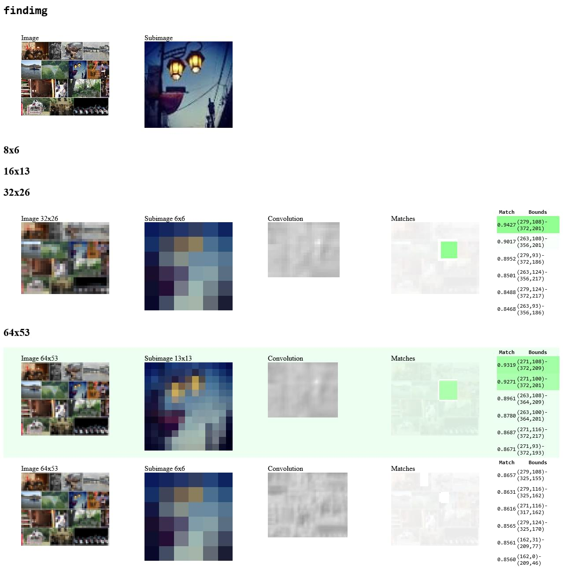

<!-- HEADER -->
<br />
<p align="center">
  <a href="https://github.com/SmilyOrg/findimg">
    
  </a>

  <h3 align="center">findimg</h3>

  <p align="center">
    Simple Go-based image template matching command line tool.
    <br />
    <br />
    <a href="https://github.com/SmilyOrg/findimg/issues">🐛 Report Bug</a>
    ·
    <a href="https://github.com/SmilyOrg/findimg/issues">💡 Request Feature</a>
  </p>
</p>


<!-- TABLE OF CONTENTS -->
<details open="open">
  <summary>Table of Contents</summary>
  <ol>
    <li>
      <a href="#about">About</a>
      <ul>
        <li><a href="#features">Features</a></li>
        <li><a href="#limitations">Limitations</a></li>
        <li><a href="#built-with">Built With</a></li>
      </ul>
    </li>
    <li><a href="#usage">Usage</a></li>
    <li><a href="#tutorial">Tutorial</a></li>
    <li><a href="#contributing">Contributing</a></li>
    <li><a href="#license">License</a></li>
    <li><a href="#acknowledgements">Acknowledgements</a></li>
  </ol>
</details>


## About

`findimg` is a Go-based image processing application designed to find and visualize matches of a sub-image within a larger image. It uses convolution to find matches and can output results in various formats including JSON and HTML (for debugging).

```sh
❯ findimg haystack.jpg needle.jpg 
0.931709  271  108  101  101
0.926643  271  100  101  101
0.895680  263  108  101  101
0.877596  263  100  101  101
0.868484  271  116  101  101
0.866736  271   93  101  100
```

See [Usage](#usage) for more examples.

### Features

* **Simple** - easy to use, no configuration required
* **Lightweight** - no dependencies, single binary, no GPU required

### Limitations

* **No rotation** - only supports translation
* **Approximate** - uses multiple scales and heuristics to find matches
* **Size** - only supports sub-images smaller than the larger image
* **Not optimal** - does not use Discrete Cosine Transform (DCT) or Fast Fourier Transform (FFT) to speed up convolution, ain't nobody got time for that

### Built With

* [Go](https://golang.org/)

## Usage

Make sure you have Go installed and run:

```sh
go install github.com/smilyorg/findimg@latest
```

Then make sure `$GOPATH/bin` is in your `$PATH` and run the following to see
if it was installed correctly:

```sh
findimg -h
```

Then you can run `findimg` with two images as arguments:

```sh
findimg image.jpg subimage.jpg
```

or to find 20 matches instead and output them as JSON:

```sh
findimg -k 20 -o json image.jpg subimage.jpg
```

or as HTML for debugging:

```sh
findimg -o html image.jpg subimage.jpg > result.html
```

## Tutorial

Let's say we have a large image called `haystack.jpg` and we want to find
matches of a smaller image called `needle.jpg` within it.

[haystack.jpg](assets/haystack.jpg)

[](assets/haystack.jpg)

[needle.jpg](assets/needle.jpg)

[](assets/needle.jpg)


We can simply run:

```sh
findimg haystack.jpg needle.jpg
```

And we will get the following output:

```sh
0.931879  271  108  101  101
0.927053  271  100  101  101
0.896113  263  108  101  101
0.878006  263  100  101  101
0.868701  271  116  101  101
0.867084  271   93  101  100
```

By default, `findimg` will output the matches in the following format:

```sh	
<match> <x> <y> <width> <height>
```

Where `match` is a value between 0 and 1 indicating how similar the sub-image
is to the larger image. The higher the match, the more similar the images are.
A match below 0.9 is usually not a good match, and a match above 0.95 is
usually a good match.

`x` and `y` are the coordinates of the top-left corner of the sub-image within
the larger image. `width` and `height` are the dimensions of the sub-image.

Let's also print only the best match in JSON format and format it with [jq]:

```sh
findimg -k 1 -o json haystack.jpg needle.jpg | jq
```

```json
{
  "matches": [
    {
      "bounds": {
        "x": 271,
        "y": 108,
        "w": 101,
        "h": 101
      },
      "match": 0.9318791816529373
    }
  ]
}
```

And then finally, let's visualize the matches in HTML:

```sh
findimg -o html haystack.jpg needle.jpg > result.html
```

[](assets/html.jpg)

## Contributing

Pull requests are welcome. For major changes, please open an issue first to
discuss what you would like to change.

## License

Distributed under the MIT License. See [LICENSE](LICENSE) for more information.

## Acknowledgements
* [Best-README-Template](https://github.com/othneildrew/Best-README-Template)
* [readme.so](https://readme.so/)

[jq]: https://jqlang.github.io/jq/